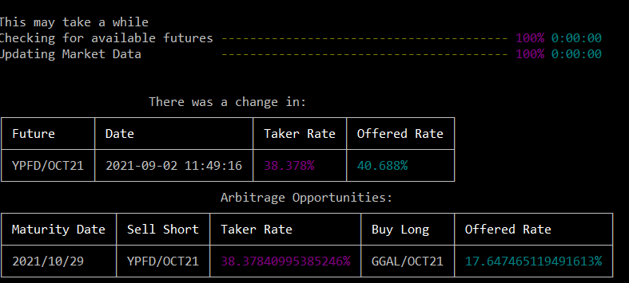
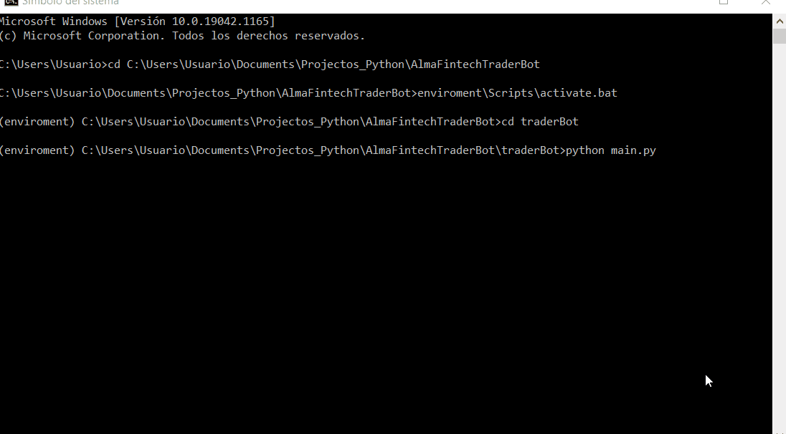

# AlmaFintechTraderBot

This readme can be found in spanish with this name: README_ES.md

This is the link to the official documentation page for the library:

[Oficial documentation](https://tradingbotalma.readthedocs.io/)

## Introduction

This python-developed module implements a simple trading bot that looks for arbitrage opportunities based on future implicit rates calculations.

To do that, it takes the relevant futures and spots information from yfinance and the remarket environment. There is a connection established through websockets with that remarket environment so that each change in the stocks of the environment triggers an action set locally to get the spots data from yfinance and then, with that data, it can calculate the taker and offered rates to then check for arbitrage possibilities.

## Installation

To use this program you must clone the repository locally.

Once done, you should run the file requirements.txt which indicates all necessary requirements to run the software. You can do this with the following lines, and it's really convenient that the installation of any requirements is done in a virtual environment to avoid dependency issues with other locally-installed packages.


```shell
$ cd <proyect_path>/AlmaFintechTraderBot
$ pip install -r requirements.txt
```

## Use

Once the requirements are installed, you can use the program with the following code:

```shell
$ cd traderBot
$ python main.py
```

With this, the program will run and show a set of menus where you can select various settings for the usage experience. The questions and options are as follows:

<ul>
  <li>Mode?
    <ul>
      <li>No Extra Info</li>
      <li>Verbose</li>
      <li>Debugging</li>
    </ul>
  </li>
  <li>How many future dollars do you want?
    <ul>
      <li>One</li>
      <li>Five</li>
      <li>All Available (takes longer)</li>
    </ul>
  </li>
  <li>Do you want to clear the console with every price change?
  <ul>
      <li>No</li>
      <li>Yes</li>
    </ul>
  </li>
  <li>What language do you prefer?
  <ul>
      <li>English</li>
      <li>Spanish</li>
    </ul>
  </li>
</ul>

After selecting the desired settings, you can begin data download. This process may take a few seconds or even minutes, depending on the number of dollar futures you requested.

When data load is finished, the system is ready and will show updated taker and offered rates for a given future after each price change. Then, it will show a chart with the available arbitrage possibilities in all possible future dates.

Here's an image of said charts:




## Arbitrage Strategy

The basic arbitrage strategy is the following:

<ul>
<li>For each price change, taker and offered rates are calculated for all futures we're interested in.</li>
<li>Then, dictionaries are updated and sorted ascending based on offered rate and descending based on taker rate</li>
<li>Once done, for each maturity date, we take the highest taker rate and the lowest offered rate and compare then against commission rates to check for arbitrage opportunities.</li>
<li>In case of an opportunity, it's stored in a dictionary that instructs to buy the minimum offered rate contract long and short the current spots, to then short buy the future with the highest taker rate and short buy the spot that corresponds to that future.</li>
</ul>

## Assumptions

<ul>
<li>It is assumed the year has 365 days (not considering leap years in rate calculations)</li>
<li>Only transactions on futures with the same maturity date are considered</li>
<li>Only one arbitrage opportunity per date is calculated, which is the best option available, considering one has no stock trading (buying or selling) limitations.</li>
<li>Inflation is partially disregarded though it should be taken into account to guarantee profit against other arbitrage strategies.</li>
<li>It is assumed that on maturity date, there is 1 remaining day until the end of a contract.</li>
</ul>


## Preview




## Upcoming Improvements

Going forward, these improvements could be implemented:

<ul>
<li>Allowing visualization of all arbitrage strategies available for each maturity date and not just the best optiont.</li>
<li>Implementing different types of arbitrage possible, to widen the scope of possibilities for action against future prices.</li>
<li>Change the data loading procedure at the beginning of the program. Currently, for each future we want to look at, we load its maturity date and that takes longer than just retrieving all data and then filtering locally.</li>
<li>Implementing the possibility of looking at all future prices in a chart. This data is already in a dictionary, so all that's left is to show that in the console if selected in the main menu.</li>
</ul>
