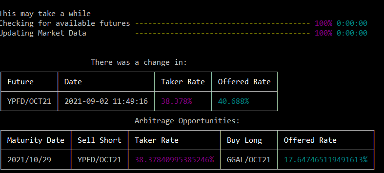
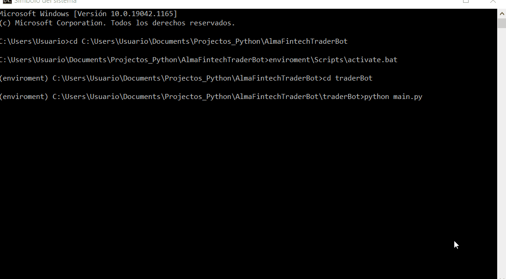

# AlmaFintechTraderBot

El readme en idioma ingles se puede encontrar en el repositorio con el nombre README.md

El siguiente es el link a la pagina de la documentación oficial de la librería: 

[Documentacion oficial](https://tradingbotalma.readthedocs.io/)

## Introduccion

Este modulo desarrollado en python implementa un bot de trading simple que busca posibilidades de arbitraje en base a los calculos de tasas implicitas realizados en los futuros.

Para eso se extrae la informacion relevante respecto de los futuros y de los spots en sí desde yfinance y desde el entorno remarket. De esta manera se realiza una conexion por websockets con el entorno remarket por lo que en cada cambio de las acciones en el entorno se llama localmente a una rutina de accion para que obtenga los datos de los spots desde yfinance y luego con esos datos poder calcular la tasa tomadora y colocadora para luego verificar las posibilidades de arbitrage.

## Instalación

Para poder utilizar este programa hay que clonar el repositorio de forma local.

Una vez hecho esto se debe de correr el archivo requierements.txt que indica todos los requerimientos necesarios para correr el software. Se puede hacer esto con las siguientes líneas, y es muy conveniente que la instalación de los requerimientos se realice en un entorno virtual para evitar tener problemas con las dependencias con los demás paquetes instalados localmente.


```shell
$ cd <proyect_path>/AlmaFintechTraderBot
$ pip install -r requirements.txt
```

## Uso

Una vez instalados los requerimientos se puede hacer uso del programa con las siguientes líneas de código:

```shell
$ cd traderBot
$ python main.py
```

De esta manera el programa arrancará y se mostrará un conjunto de menues donde seleccionar las opciones que se consideren pertinentes segun las necesidades del momento, las preguntas con las respectivas opciones son:

<ul>
  <li>Mode?
    <ul>
      <li>No Extra Info</li>
      <li>Verbose</li>
      <li>Debugging</li>
    </ul>
  </li>
  <li>How many future dollars do you want?
    <ul>
      <li>One</li>
      <li>Five</li>
      <li>All Available (takes longer)</li>
    </ul>
  </li>
  <li>Do you want to clear the console with every price change?
  <ul>
      <li>No</li>
      <li>Yes</li>
    </ul>
  </li>
  <li>What language do you prefer?
  <ul>
      <li>English</li>
      <li>Spanish</li>
    </ul>
  </li>
</ul>

Luego de seleccionar las opciones que se deseen se puede da comienzo a la descarga de los datos, este proceso puede tardar unos segundos o minutos dependiendo del numero de futuros de dolares que hayamos solicitado.

Cuando termina la carga de datos el sistema está listo y para cada cambio en la contizacion de algun futuro mostrará en pantalla las nuevas tasas (tomadora y colocadora) para ese futuro y luego mostrará un cuadro con las posibilidades de arbitrage disponibles en todas las fechas de futuros posibles.

A continuación se muestra una imágen de dichas tablas:



## Estrategia de Arbitrage

La estrategia basica de arbitrage es la siguiente:

<ul>
<li>Por cada cambio se calculan las tasas tomadoras y colocadoras para todos los futuros que nos interesan. </li>
<li>Luego se actualizan los diccionarios y se ordenan de forma ascendiente (de menor a mayor) en base al offered rate y en forma descendiente (de mayor a menor) en base al taker rate</li>
<li>Una vez hecho esto se toman para cada fecha de cierre de contrato el mayor taker rate y el menor offered rate y se los compara junto con la tasa de comision para comprobar si existe posibilidad de arbitraje.</li>
<li>En caso de que hubiera posibilidad de arbitrar se indica guarda en un diccionario la posibilidades de arbitraje indicando dentro que se debe comprar en largo el contrato con el minimo offered rate, vendiendo en corto por ende los spots actuales y luego se compra en corto el futuro con la tasa tomadora mayor y se compra en corto el spot correspondiente a ese futuro.</li>
</ul>

## Suposiciones

<ul>
<li>Se asume que el año tiene 365 días (no considerando años bisciestos en el calculo de las tasas)</li>
<li>Se consideran solamente las transacciones con futuros de igual fecha de finalizacion del contrato</li>
<li>Se calcula una unica posibilidad de arbitrage por fecha (la mejor de todas las posibles) considerando que se puede acceder a las cantidades deseadas de una accion sin limitaciones a la compra o venta de las mismas.</li>
<li>Se desprecia parcialmente la inflación aunque se ha de tener en cuenta para garantizar ganancias frente a otras estrategias de arbitraje.</li>
<li>Se considera que el día de cierre del contrato tiene 1 día restante hasta el fin de ese contrato.</li>
</ul>


## Vista Previa




## Mejoras Futuras

A futuro se podrían implementar las siguientes mejoras:

<ul>
<li>Permitir la visualizacion de todas las estrategias de arbitrage disponibles para cada fecha de cierre y no solo la mejor de estas.</li>
<li>Implementar diferentes tipos de arbitrages posibles, para ampliar el escenario de posibilidades de accion frente a los precios de los futuros</li>
<li>Modificar la forma de cargar los datos al inicio del programa desde remarket, actualmente para cada futuro que nos interesa se carga su maturity date y esto lleva mas tiempo que traer los datos de todos los futuros en un solo llamado y despues filtrar solo los que nos interesan localmente.</li>
<li>Implementar la posibilidad de ver en una tabla todos los precios de los futuros, estos datos ya se encuentran implementado en un diccionario, solo restaría mostrarlos en la consola de ser seleccionado en un apartado del menu de inicio correspondiente.</li>
</ul>
